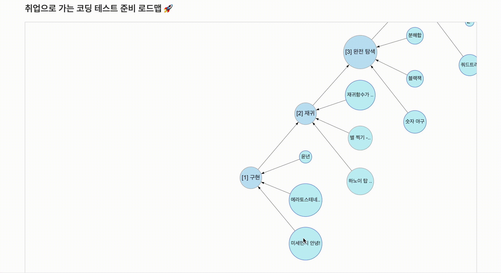

# 개인 맞춤 코딩테스트 학습 서비스 - 알고파(algopa)

Software Maestro 12기 LIMO팀(이종아, 고동천, 박효진) 서비스 `algopa`의 Front-end 레포지토리입니다.

 

## URL 🚦

- Service : https://algopa-web.vercel.app/
- GitLab: https://git.swmgit.org/swm-12/12_swm06/algopa-web
<!-- - Github : https://github.com/gywlsp/algopa-web -->

 

## 프로젝트 목표 🍀

- 효율적인 코딩테스트 준비 유도
  <!-- - 폐의약품 수거함 위치제공으로 올바른 폐기 유도 -->
  <!-- - 폐의약품 종류별 폐기방법 인식 -->
  <!-- - 무분별한 약품폐기로 인한 환경오염 사례 제공으로 심각성 인지 -->

 

## 주요 기능 소개 ✨

> 1. **코딩테스트 준비 로드맵**
>
>    코딩테스트 출제 경향을 분석하여 제작한 로드맵 을 제공하여,  사용자가 자연스럽게 코딩테스트를 준비할 수 있게 합니다.
>
>    - 어떤 유형부터 공부해야 하는지, 유형마다 어떤 문제들이 있는지 확인할 수 있습니다.
>    - 유형 오답률, 문제 풀이 유무 또한 확인할 수 있습니다. 풀이 이력을 기반으로 표시됩니다.
>        
>
> 2. **사용자 맞춤 문제 추천**
>
>    사용자 개인에 맞춰 문제를 추천해주어,  사용자가 문제를 고르는 시간을 절약할 수 있게 합니다.
>
>    - 사용자의 실력을 파악해 다음과 같은 문제를 추천합니다.
>      1. 풀이 이력을 종합적으로 고려한 문제
>      2. 최근에 푼 문제 다음으로 풀면 좋은 문제
>      3. 오답률이 높은 유형의 문제
>      4. 적게 푼 유형의 문제
>           
>
> 3. **문제 풀이 코드 작성 과정 로깅**
>
>    사용자의 코드 작성 과정을 기록해주어,  사용자가 문제 풀이 과정을 리뷰하기 쉽게 합니다.
>
>    - 사용자가 서비스 내에서 문제 풀이 코드를 작성하면 시스템이 자동으로 그 과정을 로그로 저장합니다.
>    - 코드 작성 과정을 재생하여 볼 수 있습니다.
>    - 특정 시점의 코드를 볼 수 있습니다.
>    - 메모 등의 인덱싱을 이용해 원하는 로그를 빠르게 찾을 수 있습니다.
>        
>
> 4. **문제 풀이 수행 노트**
>
>    사용자가 적은 메모와 해당 시점의 코드 쌍들을 종합해 수행 노트를 만들어주어,  사용자가 문제 풀이 과정을 리뷰하기 쉽게 합니다.
>
>    - 코드 작성 과정 중에, 또는 로그 목록에서 로그를 선택한 후 메모를 남길 수 있습니다.
>    - 사용자가 남긴 메모와 해당 시점의 코드를 종합한 수행 노트 pdf를 확인할 수 있습니다.

 

 

## 주요 기능 캡쳐 📸

<table>
   <tr style = "background-color:#00000000;">
     <th style = "text-align:center; border-style:none;">
       <h3>코딩테스트 준비 로드맵</h3>
     </th>
  </tr>
   <tr style = "background-color:#00000000; border-style:none;">
     <td align="center">
        
         <figure>
              
             <figcaption>첫 로딩</figcaption>
         </figure>
         <figure>
              
             <figcaption>유형 오답률, 문제 풀이 유무 표시</figcaption>
         </figure>
         <figure>
              
             <figcaption>노드 클릭을 이용한 zoom, 화면 이동</figcaption>
         </figure>
         <figure>
              
             <figcaption>노드 더블클릭시 나타나는 문제 Modal</figcaption>
         </figure>
          
     </td>
  </tr>
   <tr style = "background-color:#00000000;">
     <th style = "text-align:center; border-style:none;">
       <h3>사용자 맞춤 문제 추천</h3>
     </th>
  </tr>
   <tr style = "background-color:#00000000; border-style:none;">
     <td align="center">
        
         <figure>
              
             <figcaption>종합 문제 추천</figcaption>
         </figure>
         <figure>
              
             <figcaption>다음으로 풀면 좋은 문제 추천</figcaption>
         </figure>
         <figure>
              
             <figcaption>많이 틀리는 유형의 문제 추천</figcaption>
         </figure>
         <figure>
              
             <figcaption>적게 푼 유형의 문제 추천</figcaption>
         </figure>
          
     </td>
  </tr>
</table>

 
